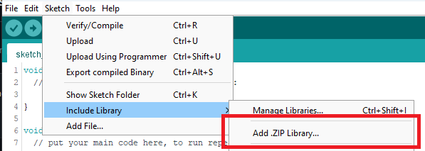

# SDVX Turbocharger-style LEDS Strip

Easy-to-use library to get Turbocharger-style LEDs on existing SDVX arduino code. This code targets both standard WS2812b strips as well as the MBI6024 chips used in the actual Turbocharger controller.

Click [here to see a test video!](https://www.youtube.com/watch?v=Q7s8RWTsb6Y)

## How to Install

Download this repo using the `Code -> Download ZIP` button in the top right, then install in the Arduino IDE using the manual install option.



In addition, the [FastLED](https://github.com/FastLED/FastLED) library must be installed for WS2812b.

## How to Use

This library only handles the LEDs. It must be inserted into properly working SDVX code for full functionality.

There's 4 places where code needs to be added:

### Location 1 - Definition

Prior to the setup loop, the following lines must be added:
```c++
#define SDVX_LED_PIN 10
#define SDVX_NUM_LEDS 16
#include <SdvxLedStrip.h>
SdvxLedStrip sdvxLeds(160, 0, 7, 20);
```
Where the defines are:
| Define        | Description |
|:-------------:|:------------|
| SDVX_LED_PIN  | This is the pin number of the LED output, if using WS2812b. If using MBI6024, this define can be ignored and the chips must be wired to the SPI pins. |
| SDVX_NUM_LEDS | This is the number of LEDS in the strip, if using WS2812b. If using MBI6024, this define can be ignored and the default of 24 is used. |

And where there are 6 arguments for the constructor:

| Variable       | Description |
|:--------------:|:------------|
| hueLeft        | This is the hue of the left knob color. Valid range is 0 to 255. Default is 160. |
| hueRight       | This is the hue of the left knob color. Valid range is 0 to 255. Default is 0. |
| burstWidth     | This is the width of the burst. Larger will make the burst bigger. Default is 7. |
| scrollSpeed    | This is the time, in ms, that the burst scrolls through the strip. Lower will make it faster. Default is 20. |
| directionLeft  | This indicates the direction on the left knob which corresponds to the burst movement. Default is false. |
| directionRight | This indicates the direction on the right knob which corresponds to the burst movement. Default is true. |

### Location 2 - Update

In the main loop, add the line:
```c++
sdvxLeds.update();
```
Which will trigger the LEDs to update.

### Location 3 - Left Encoder

In the function that updates the left encoder, add the following line when moving in one direction:
```c++
sdvxLeds.setLeftActive(true);
```
And this line when moving in the other direction:
```c++
sdvxLeds.setLeftActive(false);
```

### Location 4 - Right Encoder

In the function that updates the right encoder, add the following line when moving in one direction:
```c++
sdvxLeds.setRightActive(true);
```
And this line when moving in the other direction:
```c++
sdvxLeds.setRightActive(false);
```

## Notes

Due to the use of FastLED, there will be additional processing required to set the LEDs. The exact impact will be dependent on the number of LEDs and the other code. 

## Examples

Usage of this library is demonstrated at [in this code](https://github.com/veroxzik/RhythmCodes/tree/tc-leds/2E8B8LED1ARGB_sdvx/leo).

## Donate

If you appreciate this library or the other projects I do, you can make a monetary donation below. Thanks!

[](https://www.paypal.com/donate/?business=6M7ENNVE2ZP5Q&no_recurring=1&currency_code=USD)
